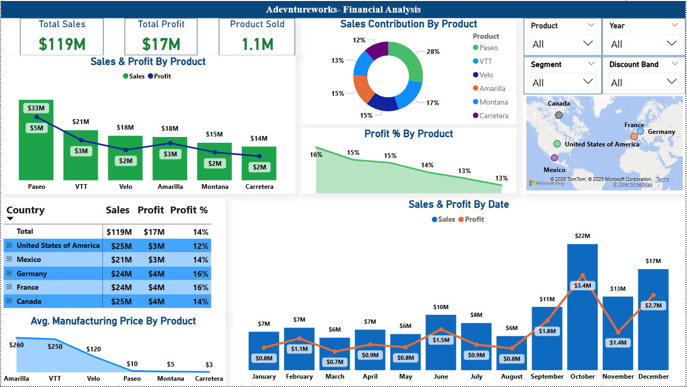

# Power BI Sales Dashboard 📊

This Power BI dashboard provides a comprehensive overview of product-wise, time-wise, and geography-wise sales and profit performance.

---

## 🔍 Key Insights
- 💰 **Total Sales**: $119M | **Total Profit**: $17M | **Profit Margin**: ~14%
- 📦 **Products Sold**: 1.1M units

### 🧾 Product Performance
- 🔝 **Top-selling Product**: *Paseo* ($33M in Sales, $5M in Profit)
- 💸 **Most Profitable Product**: *Amarilla* ($3M Profit, 16% Margin)
- 📉 **Lowest Revenue Product**: *Carretera* ($13.8M)

### 🌍 Country-wise Performance
- 🏆 **Highest Profit %**: France (16%)
- 😓 **Lowest Profit %**: USA (12%)

### 📆 Monthly Trends
- 🚀 **Peak Sales Month**: October ($22M)
- 💹 **Peak Profit Month**: October ($3.4M)

📌 *Sales & profits peak in Q4, likely driven by year-end promotions.*

---

## 🖼️ Dashboard Preview

---

## 🧰 Tools & Technologies
- Power BI
- DAX
- Data Modeling & ETL (Power Query)

---

## 📂 Files
| File | Description |
|------|-------------|
| `Sales_dashboard.pbix` | Main Power BI report |
| `README.md` | Project overview |
| `images/` | Screenshots and visuals |

---

## 📬 Contact
Created by [Ritesh Kumar](https://www.linkedin.com/in/your-link/)  
Feel free to reach out for collaboration or feedback!
